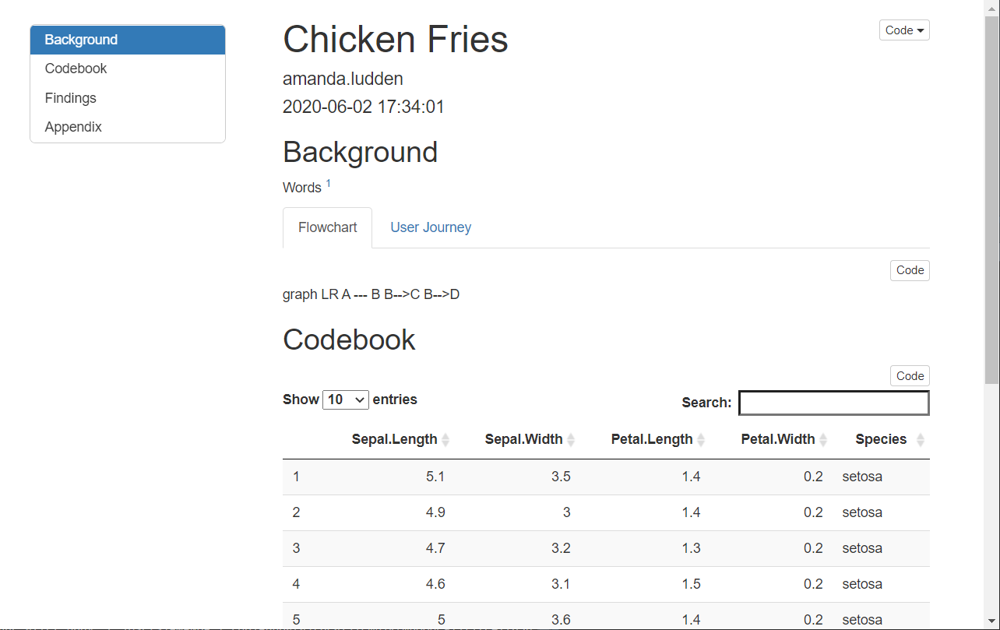
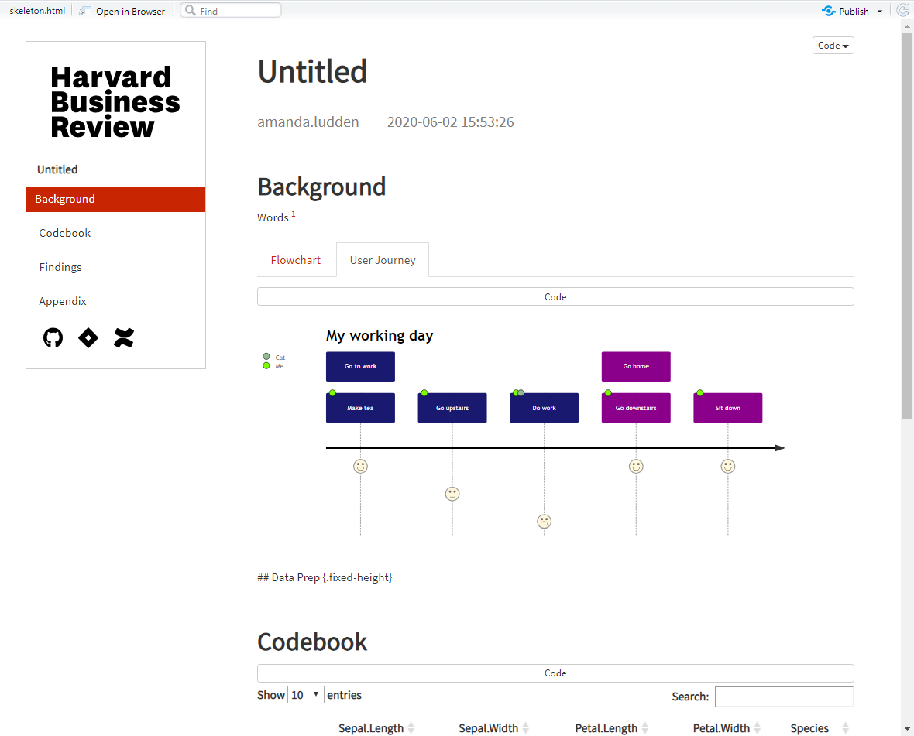
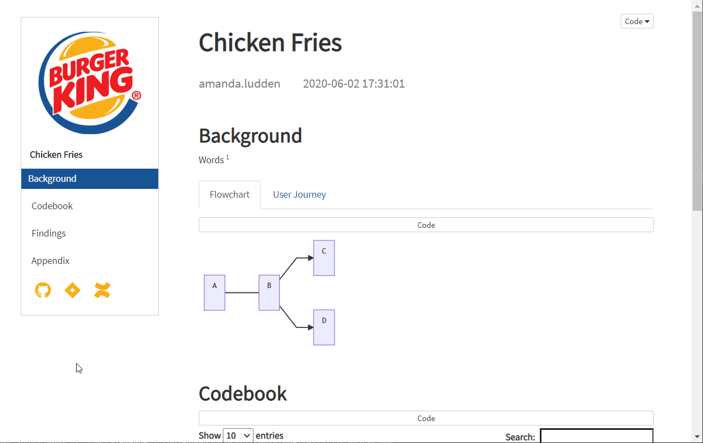
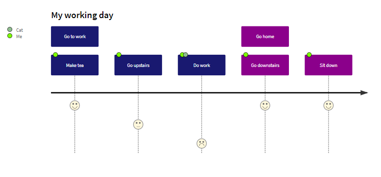

# brandish

<!-- badges: start -->
<!-- badges: end -->

Amanda's RMarkdown templates

| Default          | Branded      | Branded     |
|------------------|--------------|-------------|
|  |  |  |

<!-- TOC -->

- [brandish](#brandish)
    - [Installation](#installation)
    - [Overview](#overview)
    - [Using brandish from RStudio](#using-brandish-from-rstudio)
    - [Using brandish outside of RStudio](#using-brandish-outside-of-rstudio)

<!-- /TOC -->

## Installation

You can install and use this package from Github as follows:

```r
remotes::install_github("derring-do/brandish")
```

## Overview

Currently, **brandish** has just one `skeleton.Rmd` template that extends RMarkdown's default `html_document` format in a few ways:

1. Takes parameterized design elements to add brand logos, links, and colors

    ```yaml
    params:
        title: "Untitled"
        accent_color: "#c82502"
        icon_fill: "black"
        jira: "https://www.atlassian.com/software/jira"
        github: "https://github.com"
        confluence: "https://www.atlassian.com/software/confluence"
        logo_url: "https://hbr.org/resources/css/images/HBR_logo_black.svg"
        logo_height: "150px"
    ```

1. Sources Mermaid.js so you can use more Mermaid formats, e.g.:
       
<table>
    <tbody>
        <tr>
    <td>
    
    ```{r, results="asis"}
    htmltools::HTML('
    <div class="mermaid">
        journey
        title My working day
        section Go to work
            Make tea: 5: Me
            Go upstairs: 3: Me
            Do work: 1: Me, Cat
        section Go home
            Go downstairs: 5: Me
            Sit down: 5: Me
    </div>
    ')
    ```
</td>
<td>



</td>
</tr>
</tbody>
</table>

3. Makes some choices about fonts, spacing, margins, etc. See head.Rmd.

## Using brandish from RStudio

To use brandish from RStudio:

1. Install the latest RStudio
2. Install the **brandish** package
3. Use the New R Markdown dialog to create a document from one of the templates

## Using brandish outside of RStudio

1. Install pandoc using the instructions for your platform.

1. Install the brandish packages.

1. Use the `rmarkdown::draft()` function to create articles:

```r
rmarkdown::draft("myNotebook.Rmd", template = "brandish", package = "rticles")
```